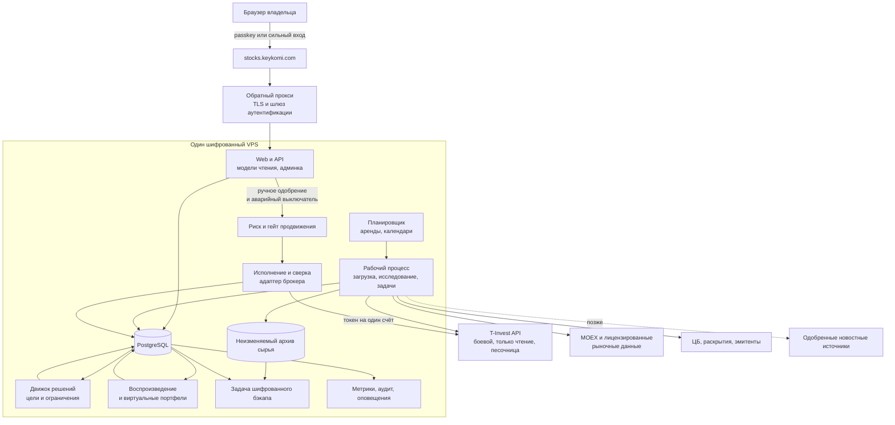
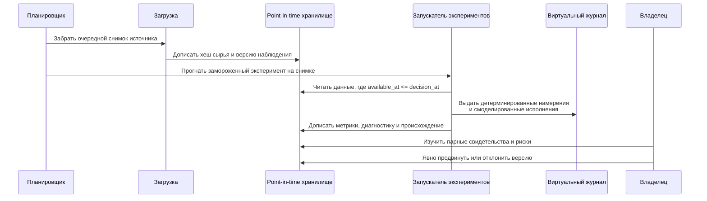
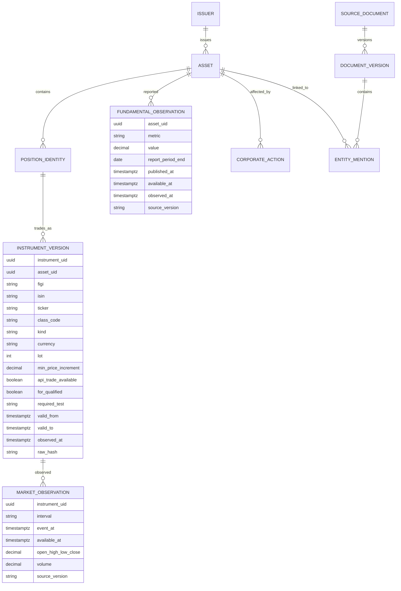
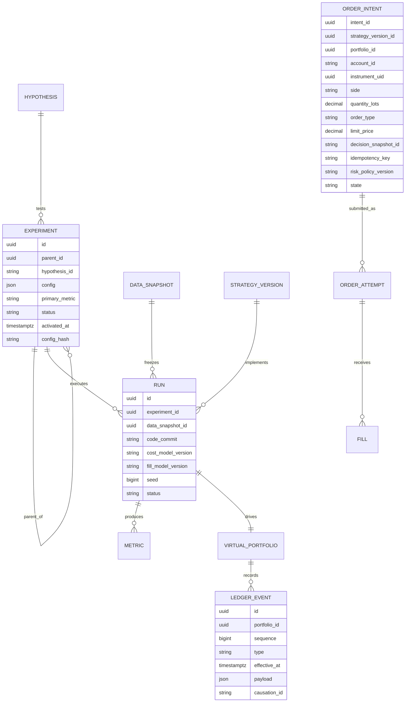

---
artifact:
  id: nagi-architecture
  type: architecture
  title: Nagi — self-hosted лаборатория систематического управления портфелем
  status: proposed
  created_at: 2026-08-01
  updated_at: 2026-08-01
  owners: [repository-owner]
  assumptions:
    - изначально один человек-владелец
    - один скромный VPS, требований к задержке как в HFT нет
    - только длинные позиции без плеча в первом релизе
    - каждое инвестиционное и исполнительное решение принимает детерминированный алгоритм
    - в первом релизе система выдаёт рекомендации, сделки исполняются вручную
    - расчётный размер портфеля до 500 000 ₽, вселенная мультиактивная
  unresolved_questions:
    - лицензированный источник point-in-time данных и права на хранение
    - фактическое покрытие полей T-Invest и тариф счёта, наличие минимальной комиссии
    - обычный брокерский счёт или ИИС-3
    - инвестируемый бенчмарк
---

# Архитектура Nagi

## Требования и характер нагрузки

### Функциональные

- непрерывно версионировать вселенную торгуемых инструментов и доступность их
  для счёта;
- загружать point-in-time цены, фундаментальные показатели, макропубликации,
  корпоративные события и позже — отобранные новости;
- выполнять воспроизводимые бэктесты и одновременные виртуальные портфели с
  идентичными денежными потоками;
- регистрировать неизменяемые гипотезы, конфигурации, наборы данных, прогоны и
  метрики;
- рекомендовать распределение средств, выводы и ребалансировку через
  детерминированный код;
- показывать владельцу рекомендацию с объяснением и сверять её с фактическими
  действиями на реальном счёте, читаемом токеном только на чтение;
- проверять замороженного кандидата в теневом режиме и, если это будет решено
  позже, в песочнице T-Invest;
- только после явного продвижения — отправлять и сверять строго ограниченные
  реальные заявки;
- предоставлять на `stocks.keykomi.com` дашборды, свидетельства и элементы
  управления одному владельцу, с возможностью появления семейных ролей позже.

### Нефункциональные

- проверяемость и сохранность капитала важнее задержки;
- point-in-time и битемпоральное происхождение данных, детерминированное
  воспроизведение;
- идемпотентная отправка заявок и сверка с брокером;
- простая эксплуатация на одном хосте, ежедневные бэкапы, наблюдаемая свежесть
  данных;
- корректная деградация в режим только чтения при сбое источника или модели;
- никаких брокерских токенов, отчётов, персональных и налоговых данных в
  браузерном хранилище и в логах.

### Оценка начального масштаба (оценка, не измерение)

- от тысяч до десятков тысяч версий инструментов;
- дневные и минутные свечи по сотням или нескольким тысячам значимых
  инструментов;
- от 5 до 20 виртуальных портфелей и менее десятков экономических решений в месяц;
- сотни сырых документов в день, только если будет включена новостная фаза;
- один интерактивный пользователь и фоновые рабочие процессы на одном VPS.

Такая нагрузка не оправдывает микросервисы, Kafka, Kubernetes, feature store и
векторную базу данных.

## Варианты и решение

| Вариант | Сильная сторона | Издержки и риск | Решение |
|---|---|---|---|
| Модульный монолит плюс PostgreSQL плюс файлы объектов | транзакции, зрелый бэкап, JSON и сырые метаданные, одно развёртывание | требуется дисциплина работы со схемой | **Выбрано** |
| Модульный монолит плюс SQLite | самый простой локальный старт | слабее для параллельных процессов и эксплуатации, потребует миграции позже | полезно для тестов, отклонено как источник истины на VPS |
| Микросервисы плюс очередь плюс отдельные хранилища временных рядов и векторов | независимое масштабирование | большая эксплуатационная нагрузка и проблемы согласованности без измеренной потребности | отклонено |

Начинать как один репозиторий с отдельно запускаемыми процессами API, рабочего и
планировщика, разделяющими версионированные доменные модули. PostgreSQL владеет
реляционным состоянием и журналами только на добавление. Сжатые неизменяемые
сырые ответы и архивы лежат в каталоге объектов на шифрованном томе; база данных
хранит хеш, размер, провенанс и политику хранения. Транзакционного аутбокса и
таблицы аренд достаточно для фоновых задач. Настоящая очередь добавляется только
после измеренной конкуренции за ресурсы.

### Выбор технологий

Рекомендация — **Python как единственная среда исполнения**, без второго рантайма:

| Слой | Выбор | Обоснование |
|---|---|---|
| Ядро исследования | Python с polars или pandas, numpy, scipy | оптимизатор, статистика и walk-forward на другом языке означают лишнюю работу |
| Оптимизатор | cvxpy либо scipy | задача выпуклая с линейными ограничениями; целые лоты — округлением с проверкой допустимости |
| Брокер | официальный `tinkoff-investments` с асинхронным клиентом | единственный поддерживаемый SDK с async |
| Хранилище | PostgreSQL, партиционирование по времени | транзакции, JSONB для сырья, зрелый бэкап; TimescaleDB на этом объёме не нужен |
| Планировщик | таблица заданий в PostgreSQL плюс аренда через advisory lock | Airflow на одном VPS — избыточная эксплуатационная нагрузка |
| Web и API | FastAPI с серверным рендерингом | одна среда исполнения, дашборду не нужен SPA |
| Доставка | Docker Compose, Caddy или Traefik для TLS | домен `stocks.keykomi.com`, автоматический сертификат |
| Аутентификация | passkey и WebAuthn либо пароль с TOTP | один владелец; роль наблюдателя для семьи позже и отключена по умолчанию |

Сохранение Java-сборщика новостей как отдельного развёртывания добавило бы второй
рантайм и вторую границу схемы. Переносить следует его хорошие паттерны адаптеров,
если только зонд не докажет, что поддерживать его дешевле.

## Контекст и компоненты



В первом релизе блок `Exec` присутствует как объявленный контракт адаптера, но не
отправляет заявки: терминальное состояние намерения — «показано владельцу».

### Ответственность модулей

| Модуль | Владеет | Не должен делать |
|---|---|---|
| Адаптеры источников | сырые запросы, метки времени, хеши, ретраи | нормализацией уничтожать свидетельства источника |
| Справочник инструментов | идентичность, доступность, псевдонимы, корпоративные действия | выводить историческое состояние из текущих строк |
| Конвейер признаков | нормализованные point-in-time наблюдения признаков | ставить заявки и молча заполнять пропуски |
| Реестр экспериментов | гипотезы, конфигурации, происхождение данных и прогонов, метрики | изменять активированные эксперименты |
| Симулятор | деньги, позиции, лоты, исполнения, издержки, детерминированное воспроизведение | использовать P&L песочницы как истину |
| Движок решений | целевые веса и предлагаемые переходы | вызывать брокера или языковую модель |
| Риск и продвижение | доступность, жёсткие лимиты, состояние одобрения, аварийный выключатель | оптимизировать доходность |
| Исполнение и сверка | идемпотентные команды брокеру и исполнения | придумывать инвестиционное намерение |
| Web и API | дашборды, объяснения и явные элементы управления | держать брокерские токены в клиентском коде |
| Опциональная лаборатория ИИ | кандидатные метки событий с обоснованием и стоимостью | становиться обязательной зависимостью или источником права на заявку |

## Основные потоки

### Исследование и продвижение



### Безопасная отправка заявки

Относится к уровню L5 и далее, то есть только если после L4 будет решено
включать автоисполнение.

```mermaid
sequenceDiagram
    participant Dec as Движок решений
    participant Gate as Риск и гейт продвижения
    participant Out as Журнал намерений и аутбокс
    participant Ex as Исполнитель
    participant Br as T-Invest
    participant Rec as Сверщик

    Dec->>Out: Дописать предложенное намерение<br/>с ID снимка и конфигурации
    Gate->>Out: Одобрить точное намерение после проверки<br/>лимитов и состояния владельца
    Ex->>Out: Атомарно арендовать одобренное намерение
    Ex->>Br: PostOrder с ключом идемпотентности
    alt детерминированно принято или отклонено
      Br-->>Ex: Идентификаторы брокера и биржи, статус
      Ex->>Out: Дописать результат
    else таймаут или неоднозначный результат
      Br-->>Ex: Нет ответа
      Ex->>Out: Пометить UNKNOWN;<br/>новый ключ не создавать
      Rec->>Br: Запросить заявки, операции и позиции
      Rec->>Out: Разрешить или эскалировать;<br/>торговля остаётся на паузе
    end
    Rec->>Br: Периодическая сверка с отчётом брокера
    Rec->>Out: Дописать исполнения, комиссии и расхождения
```

## Владение данными и контракты

### Основная идентичность и point-in-time данные



Использовать UID брокера и биржи как естественные внешние идентичности, но
хранить внутренние UUID и таблицы псевдонимов с историей. Тикер никогда не
является первичным ключом. Денежные величины хранить как точные десятичные
значения или компоненты nano, никогда как двоичные числа с плавающей точкой.

Переносимую сущность бумаги моделировать тремя слоями, повторяя документированную
иерархию брокера: `asset` (экономический объект), `position_identity` (актив в
контексте площадки и депозитария) и версионированный `instrument` (торгуемый
контракт). Общие поля идентичности и торговли держать в ядре, а типизированные
расширения — в таблицах `share_terms`, `bond_terms`, `fund_terms`,
`currency_terms`, `commodity_terms` и, только если это будет разрешено позже,
терминах производных. Не втискивать графики купонов, акционерный капитал и СЧА
фонда в одну разреженную универсальную строку.

Поскольку выбрана мультиактивная вселенная, эти расширения нужны с самого начала,
а не позже: `bond_terms` обязаны нести номинал, график купонов, НКД, дату
погашения и рейтинг эмитента, `fund_terms` — стоимость пая и плату за управление,
`commodity_terms` — единицу измерения и порядок расчётов.

### Журнал экспериментов и портфелей



Скор не является изменяемой колонкой инструмента. Значение признака ключуется
определением и версией признака, сущностью, `as_of`, `available_at` и прогоном.
Составные скоры и целевые веса — производные артефакты, привязанные к версии
стратегии. Это позволяет держать пять или пятьдесят стратегий, не перезатирая
состояние друг друга. Конфигурация стратегии содержит препроцессинг, веса
признаков, ограничения и ссылки на версии моделей; её каноническая сериализация
вместе с коммитом исходников образует хеш содержимого. Планировщик дописывает
новый прогон вычисления и строки сигналов, а заменяемая материализованная модель
чтения обслуживает дашборд.

### Контракт адаптера брокера

Запросы: `list_accounts`, `capabilities(account)`, `portfolio`, `positions`,
`operations`, `instrument`, `market_snapshot`, `order_state`.

Команды: `place(intent)`, `replace(intent, prior_order)`, `cancel(order)`.

Нормализованные состояния заявки: `PROPOSED`, `APPROVED`, `SUBMITTING`,
`ACCEPTED`, `PARTIAL`, `FILLED`, `CANCELLED`, `REJECTED`, `UNKNOWN`. Каждый
переход дописывается и сохраняет сырой ответ брокера по хешу. Состояние `UNKNOWN`
блокирует новые заявки по затронутому счёту до сверки или явного действия
владельца.

В первом релизе реализуются только запросы, и только через токен на чтение.
Команды объявлены в контракте, но не имеют реализации на боевом счёте.

## Согласованность, отказы и восстановление

- Одна транзакция PostgreSQL дописывает одобренное намерение и запись аутбокса.
- Рабочие процессы арендуют задачи с истечением срока; каждая загрузка
  идемпотентна по источнику, внешнему идентификатору с версией и хешу содержимого.
- Ретраи используют ограниченную экспоненциальную задержку, заголовок
  `Retry-After`, общий ограничитель на сервис и дрожание. Постоянные ошибки схемы,
  аутентификации и прав уходят в карантин.
- Сбой источника оставляет последний снимок для отображения, но делает его
  непригодным для новых решений после истечения срока свежести. Торговля
  отказывает в безопасную сторону.
- Таймаут брокера означает неоднозначность, а не отказ. Нужно повторно запросить
  состояние с тем же ключом идемпотентности и счётом и выполнить сверку операций и
  позиций до любой повторной попытки.
- Брокер является источником истины по реальным исполнениям, комиссиям и позициям;
  локальные расхождения порождают оповещение и условие паузы, но никогда не
  исправляются молча.
- Виртуальные портфели пересобираются из упорядоченных событий журнала и хешей
  снимков; периодические контрольные точки ускоряют воспроизведение, но являются
  одноразовыми.
- Ежедневные шифрованные бэкапы базы и сырья восстанавливаются в плановом учении.
  Начальные цели определить после измерения: предлагаемый RPO 24 часа для
  исследовательских данных и близкий к нулю для локально подтверждённых событий
  заявок и аудита за счёт немедленной отправки бэкапа; предлагаемый RTO 4 часа.
  Это цели, а не подтверждённые гарантии.

## Безопасность и наблюдаемость

### Границы доверия

- Интернет к обратному прокси: TLS, строгие заголовки, ограничение частоты и
  сильная аутентификация;
- браузер к API: защищённая сессия HTTP-only, защита от CSRF, никаких брокерских
  секретов;
- сборщик данных к T-Invest: токен только на чтение;
- исполнитель к T-Invest: токен полного доступа, ограниченный одним боевым счётом;
- песочница использует отдельный токен и отдельный класс портфеля в базе;
- опциональная языковая модель получает только минимизированный текст, без
  токенов, данных счёта и портфеля.

Секреты хранить вне Git и вне дампов базы — в файле, читаемом только root, либо в
менеджере секретов VPS. Редактировать метаданные авторизации и сырые поля ответов
брокера в логах. Шифровать диски и бэкапы, ротировать и отзывать токены, а исходящий
трафик исполнителя ограничивать, где это эксплуатационно возможно.

Для `stocks.keykomi.com` предпочтителен слой идентичности с поддержкой passkey и
WebAuthn либо сильный пароль плюс TOTP. Начальная роль владельца может продвигать
версии и ставить на паузу; будущая семейная роль наблюдателя — не может.
Добавление другого торгующего лица или счёта требует новой авторизации и разбора
защиты данных, а не просто новой строки в базе.

Наблюдать:

- свежесть источников, пропуски, ревизии и отказы парсеров по источнику и
  инструменту;
- нарушения point-in-time и пропущенность признаков;
- отставание задач, запас по квотам API и переподключения потоков;
- дрейф стратегии, атрибуцию оборота и издержек, насыщение ограничений;
- задержку от намерения до исполнения, отказы, заявки в состоянии `UNKNOWN` и
  расхождения сверки;
- бюджеты расходов на токены и языковую модель, возраст бэкапа и статус учения по
  восстановлению;
- состояние аварийного выключателя по каналу, независимому от основного дашборда.

## Ёмкость, стоимость и границы масштабирования

PostgreSQL с партиционированием по времени для свечей и наблюдений признаков
достаточен при оценённой начальной нагрузке. Записи выполнять пакетами и хранить
хеши сырья; не опрашивать каждый инструмент по отдельности. Дневным стратегиям не
нужны непрерывные потоки стакана. Минутные данные можно хранить выборочно для
исследования издержек исполнения, со сроком хранения по лицензии и измеренному
росту диска.

Стоимость языковой модели в минимальной версии равна нулю. В опциональной
новостной фазе — вводить дневные бюджеты по документам, токенам и рублям до вызова
модели; сначала дедуплицировать и извлекать только новые кандидаты, связанные с
сущностями. Кешировать результаты по хешу содержимого вместе с версией модели и
промпта. Исчерпание бюджета переводит документ в статус `UNCLASSIFIED`, но никогда
не блокирует безопасность портфеля и не вызывает сделку.

Триггеры изменения архитектуры:

- очередь: аренды в базе не обеспечивают измеренную задержку задач или не
  изолируют отказы;
- объектное хранилище: архив сырья превышает возможности надёжного бэкапа и
  восстановления с одного тома;
- отдельное аналитическое хранилище: партиции и индексы не обеспечивают SLA
  воспроизведения после тюнинга;
- выделение сервиса: появилась независимо развёртываемая граница команды или
  доступности, а не просто больше кода;
- векторный поиск: подтверждённая новостная гипотеза требует семантического
  извлечения, а более простые индексные методы не проходят измеренные требования
  к качеству и задержке.

## Валидация и миграция

1. Перенести текущий ноутбук, CSV и файл зависимостей в `legacy/` только после
   того, как новый каркас и тесты их сохранят; никогда не считать CSV истиной.
2. Построить зонд возможностей T-Invest в режиме только чтения и сохранить сырые
   ответы снимками. Первым делом выяснить наличие и размер минимальной комиссии.
3. Реализовать справочник инструментов, преобразование десятичных величин,
   битемпоральные поля и фикстуры сверки.
4. Построить эталонный набор для воспроизведения с базовой линией пассивного
   регулярного пополнения.
5. Добавить реестр экспериментов и одну прозрачную гипотезу о распределении между
   классами активов.
6. Проверить консервативную модель издержек и политику полос бездействия, а также
   парную отчётность.
7. Добавить веб-дашборд, аутентификацию и эксплуатационную наблюдаемость. Здесь
   система становится полезной: рекомендации плюс сверка с реальным счётом.
8. Принять решение, нужно ли автоисполнение. Если да — добавить адаптер песочницы
   и дымовые тесты, боевой токен по-прежнему отсутствует.
9. Прогнать замороженного кандидата в теневом режиме на явно объявленном
   горизонте.
10. Провести независимый разбор безопасности до любого предложения о запуске с
    реальными деньгами.

Статус архитектуры остаётся **предложением**. Ни один компонент не проверен в
продакшене.
