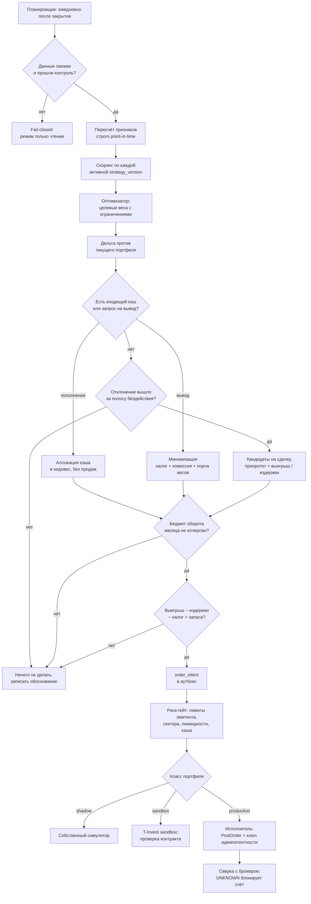
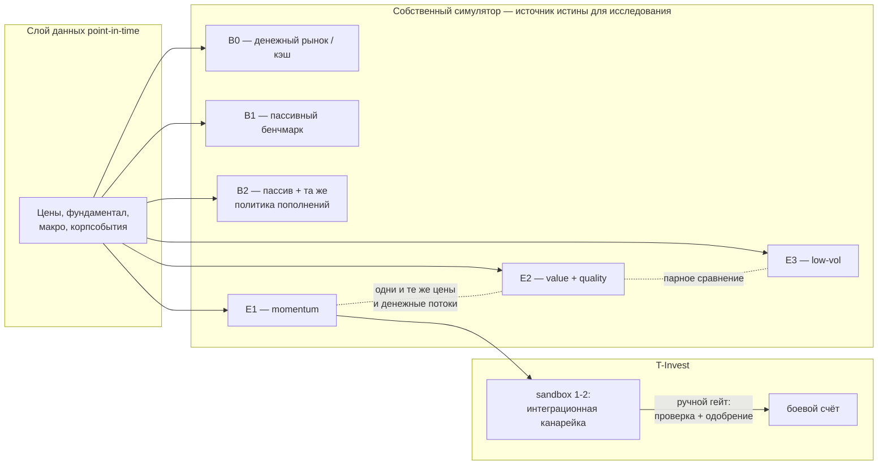

# Ключевые проектные решения Nagi — с числами

Статус: черновик для обсуждения
Дата: 2026-08-01
Дополняет: `docs/research/market-research.md`, `docs/research/experimental-protocol.md`

Документ отвечает на конкретные вопросы, поставленные владельцем, и подкрепляет
ответы расчётами. Скрипт расчётов воспроизводим, формулы приведены явно.

---

## 1. Гипотеза «HFT невыгодно из-за комиссий» — подтверждается, но по другой причине

Исходная формулировка верна в выводе и неточна в механизме. Дело не в статусе
неквалифицированного инвестора (он ограничивает *набор инструментов*, а не
размер комиссии), а в том, что **издержки пропорциональны обороту в рублях, а не
количеству сделок**.

Годовая потеря доходности от оборота:

```
drag = (годовой оборот в % от портфеля) × (издержки на одну сторону)
издержки на сторону = комиссия брокера + половина спреда + проскальзывание
```

Портфель 1 000 000 ₽, размер одной сделки указан в % от портфеля:

| Тариф (издержки/сторона) | 2 сделки/мес по 3% | 5 по 5% | 10 по 5% | 30 по 5% |
|---|---|---|---|---|
| Инвестор ≈ 0.50% | 0.36% | 1.50% | 3.00% | 9.00% |
| Трейдер ≈ 0.25% | 0.18% | 0.75% | 1.50% | 4.50% |
| Крупный портфель ≈ 0.15% | 0.11% | 0.45% | 0.90% | 2.70% |

Ориентир: долгосрочная реальная премия по акциям — единицы процентов годовых.
**30 сделок в месяц на тарифе «Инвестор» стоят 9% годовых** — это гарантированно
съедает любую реалистичную альфу. 10 сделок по 5% портфеля = 600% оборота в год,
что уже режим активного трейдинга, а не инвестирования.

### Вывод 1

Ограничивать надо **не количество сделок, а оборот в рублях**. Счётчик сделок —
плохая метрика: одна сделка на 30% портфеля дороже десяти по 1%.

Предлагаемый первичный лимит: **годовой односторонний оборот ≤ 100% портфеля**
(≈ 8% в месяц). При издержках 0.25%/сторону это 0.25% годовых потерь —
приемлемо. Счётчик сделок остаётся, но как *операционный предохранитель* от
взбесившегося цикла, а не как экономический параметр.

---

## 2. Скрытая издержка, которая в РФ важнее комиссии: потеря ЛДВ

Льгота долгосрочного владения (ст. 219.1 НК РФ) освобождает от НДФЛ прибыль по
бумагам на организованном рынке при непрерывном владении **от 3 лет**.

Продажа раньше срока — это не только комиссия, но и налог, которого могло не
быть. Скрытая цена ранней продажи ≈ `ставка НДФЛ × накопленная прибыль`:

| Прибыль по позиции | Цена потери ЛДВ (13%) | В % от позиции |
|---|---|---|
| +10% | 650 ₽ на позицию 50 000 ₽ | 1.3% |
| +25% | 1 625 ₽ | 3.2% |
| +50% | 3 250 ₽ | 6.5% |
| +100% | 6 500 ₽ | 13.0% |

По выросшей позиции налоговая издержка ранней продажи **на порядок больше
брокерской комиссии**. Для горизонта «пара лет / бесконечность» это главный
аргумент за низкий оборот.

### Что подтверждено по первоисточнику

Текст НК РФ прочитан напрямую 2026-08-01. WebSearch к тому моменту был исчерпан,
доступ получен через `curl` из Bash — сетевые ограничения на него не
распространяются, и это рабочий обходной путь для будущих проверок.

**Статья 219.1 НК РФ, ЛДВ — подтверждено дословно:**

- вычет даётся на положительный финансовый результат от реализации бумаг,
  находившихся в собственности **непрерывно более трёх лет**;
- предельный размер вычета равен **Кцб × 3 000 000 ₽**, где Кцб — количество
  полных лет нахождения бумаг в собственности; при разных сроках владения Кцб
  считается по формуле, взвешенной по доходам от реализации;
- покрываются госбумаги РФ и субъектов, муниципальные бумаги, **ценные бумаги
  российских организаций**, бумаги эмитентов из ЕАЭС и, что важно для выбранной
  конструкции, **инвестиционные паи ПИФов под управлением российских УК**;
- обязательное условие: на момент реализации бумага **обращается на
  организованном рынке**.

Два следствия. Первое: **БПИФы тоже попадают под ЛДВ**, поэтому «ядро» из фондов
не проигрывает прямому владению акциями по налогам. Второе: при портфеле
500 000 ₽ лимит Кцб × 3 млн ₽ не связывает даже близко — с трёхлетнего срока вся
прибыль укладывается в льготу с огромным запасом.

**Статья 224 НК РФ, ставки — подтверждена структура:** для налоговых баз по
операциям с ценными бумагами действует **отдельная двухступенчатая шкала
(пункт 1.1)** — 13% и 15%. Пятиступенчатая шкала 13/15/18/20/22 из пункта 1
относится к основной базе вроде зарплаты и к инвестиционному доходу не
применяется. Порог второй ступени вырезал фильтр вывода, но для портфеля
500 000 ₽ он недостижим, поэтому **в модели используется плоская ставка 13%**.

### Вывод 2

Оптимизатор обязан считать налог частью издержек сделки, с учётом даты покупки
каждого лота (FIFO-лоты, срок до трёхлетней отсечки). Продажа позиции за месяц до
трёхлетия должна требовать очень большого выигрыша.

> Остаётся непроверенным: условия ИИС-3 — минимальный срок владения для счетов,
> открытых в 2026 году, и лимиты вычетов, — а также порядок сальдирования и
> переноса убытков. В статье 219.1 встречается срок «не менее трёх лет»
> применительно к договору ИИС, но это, судя по контексту, редакция для прежних
> типов счёта. Проверить отдельно на уровне L0.

---

## 3. «Пять песочниц как A/B-тест за 2-3 месяца» — статистически невозможно

Это главное расхождение исходного замысла с реальностью, и его надо принять до
того, как будет написан код.

Стандартная ошибка оценки коэффициента Шарпа (Lo, 2002), месячные данные:

```
SE(SR_год) = sqrt( (1 + SR²/24) / T_лет )
T_лет = t_крит² × (1 + SR²/24) / SR²
```

| Шарп (год) | Лет до t=2 (95%) | Лет до t=3 (порог Harvey–Liu–Zhu при переборе) |
|---|---|---|
| 0.3 | 44.6 | 100.4 |
| 0.5 | 16.2 | 36.4 |
| 0.75 | 7.3 | 16.4 |
| 1.0 | 4.2 | 9.4 |

Реалистичная факторная стратегия на широком рынке имеет Шарп 0.3–0.6. **Чтобы
доказать её отличие от нуля, нужны десятилетия, а не месяцы.** Два-три месяца
дают шум с амплитудой в разы больше измеряемого эффекта.

### Парное сравнение помогает, но не спасает

Если две стратегии живут на одних и тех же ценах и денежных потоках, сравнивать
надо ряд *разницы* доходностей, а не два ряда по отдельности:

```
sigma_разницы = sigma × sqrt(2 × (1 - corr(A,B)))
```

При волатильности портфеля 20% и разнице в альфе 2 п.п./год:

| corr(A,B) | sigma разницы | Шарп разницы | Лет до t=2 |
|---|---|---|---|
| 0.90 | 8.94% | 0.22 | 80.2 |
| 0.95 | 6.32% | 0.32 | 40.2 |
| 0.98 | 4.00% | 0.50 | 16.2 |
| 0.99 | 2.83% | 0.71 | 8.2 |
| 0.995 | 2.00% | 1.00 | 4.2 |

Выигрыш реален (с 40 лет до 8 при очень похожих портфелях), но горизонт всё
равно измеряется годами. Чем сильнее различаются стратегии, тем **хуже**
разрешающая способность — контринтуитивно, но так работает дисперсия разницы.

### Вывод 3

- Живые песочницы **не могут** ответить на вопрос «какая формула лучше». Они
  отвечают на вопрос «работает ли интеграция, сходятся ли комиссии и сверки».
- Источник знания о качестве стратегии — **бэктест на длинной истории** с
  point-in-time данными и walk-forward, плюс сильные экономические априори.
- Живой прогон — это не эксперимент, а *приёмочное испытание* уже выбранного
  кандидата: он ловит дефекты данных, планировщика, исполнения и издержек.
- Раз песочница не даёт статистики, платить за 5 брокерских песочниц незачем.
  Дешевле и точнее держать **N теневых портфелей в собственном симуляторе** на
  общих ценах и общих денежных потоках (это и есть корректный парный дизайн), а
  песочницу T-Invest использовать как 1–2 интеграционных канарейки.

Дополнительный технический аргумент против брокерской песочницы как измерителя:
у неё фиксированная комиссия 0.05% независимо от реального тарифа, нет налогов и
дивидендов, рыночные заявки исполняются по last price без влияния на рынок, а
сами счета удаляются после 3 месяцев простоя.

---

## 4. «Жизни/попытки сделки» — заменяются полосой бездействия

Фиксированная квота (10? 30? 5?) не имеет экономического оптимума, потому что
оптимум зависит от того, *насколько* портфель отклонился и *сколько* стоит его
поправить. Правильная постановка — порог, а не счётчик.

Сделка предлагается только когда

```
ожидаемый выигрыш в полезности − издержки − налоговый эффект > запас прочности
```

Это автоматически создаёт **no-trade region**: пока отклонение от целевого
портфеля мало, выгоднее ничего не делать. Классика темы — Davis & Norman,
Constantinides, Lynch & Balduzzi, а для «частичного движения к цели» —
Gârleanu & Pedersen (торговать не в целевой портфель, а в промежуточный
aim-portfolio).

Ответы на производные вопросы владельца в этой рамке:

| Исходная идея | Замена |
|---|---|
| «+1 жизнь за пополнение счёта» | Входящий кэш аллоцируется в недовес **без продаж**. Это бесплатная ребалансировка — покупка нужного, а не продажа лишнего. Отдельная «жизнь» не нужна. |
| «+1 экстренная на случай обвала» | Не бонус, а риск-политика с заранее объявленным триггером, лимитом, кулдауном и записью в журнал. Иначе это дискреция под видом алгоритма. |
| «вывести N рублей — что продать» | Симметричная задача: найти набор продаж, минимизирующий сумму (налог + комиссия + порча целевых весов + потеря ЛДВ) при ограничении «поднять N рублей». |
| «отсортить по скору и продать худшее» | Нет. Продажа обосновывается переходом портфеля в целом, а не низким скором позиции. Причины продажи: финансирование вывода, потеря доступности бумаги, нарушение лимита, снижение риска, явно лучшая замена с учётом издержек. |

---

## 5. Где хранить скор и веса формулы

Скор **не должен быть колонкой в таблице бумаг**, которую крон перезаписывает.
Такая схема уничтожает историю и делает невозможным сравнение стратегий: пять
формул будут затирать друг друга, а вчерашнее решение станет невоспроизводимым.

Правильная модель:

- `strategy_version` — неизменяемая запись: определения признаков, лаги
  доступности, преобразования, веса, ограничения, версия модели издержек,
  хеш конфигурации и коммит кода. Изменение одного веса создаёт **новую версию**,
  а не правит старую.
- `signal_observation(strategy_version, instrument, as_of, available_at, value,
  data_snapshot)` — append-only. Никогда не обновляется.
- Материализованное представление «последний скор» — для дашборда, одноразовое и
  пересоздаваемое.

Это и есть ответ на «как одновременно держать 5 наборов весов»: они не конфликтуют,
потому что скор ключуется версией стратегии.

Форма самой формулы — робастный секторно-относительный z-score с обрезкой:

```
z(i,k,t) = clip( (x − median_сектор) / (1.4826 × MAD_сектор), −3, +3 )
s(i,t)   = Σ_k w_k × z(i,k,t)
```

Медиана и MAD вместо среднего и сигмы — потому что на рынке из ~46 имён в индексе
один выброс ломает нормировку. Обрезка на ±3 — чтобы одна бумага не доминировала.

Критично: **скор — это ранжирование привлекательности, а не приказ**. Между
скором и заявкой стоит оптимизатор с ограничениями (лоты, ликвидность, лимиты на
эмитента и сектор, кэш, доступность неквалу, издержки, налоговые лоты).

---

## 6. Новости — событийный поток, а не «настроение»

Позиция по итогам исследования: для горизонта в месяцы и годы **широкий
сентимент по 100+ статьям в день почти наверняка шум**, и платить LLM за его
измерение не нужно. Сентимент затухает быстро; то, что успевает отработать за
часы, недоступно низкочастотному инвестору с бюджетом оборота.

Что имеет смысл вместо этого — типизированные **события из первичных источников**:
раскрытия эмитентов, дивидендные решения, отчётность, купонные события, решения
ЦБ, санкционные и регуляторные акты. Это не «настроение», а факты с точной
меткой времени.

Порядок внедрения — последним, после того как факторное ядро докажет
работоспособность. Гейт активации: прирост чистой полезности портфеля после
контроля на уже работающие факторы. Метрика качества классификатора (F1) успехом
не является.

LLM в системе допускается только как **офлайн-разметчик** с версионированным
промптом, схемой ответа, бюджетом в рублях и токенах и обязательным хранением
исходного текста-обоснования. Исчерпание бюджета переводит документ в статус
`UNCLASSIFIED` и никогда не блокирует и не инициирует сделку.

Из проверенных источников чистый рабочий RSS без антибота дают **Интерфакс,
Прайм (1prime.ru) и Smart-Lab**. e-disclosure.ru и БКС закрыты JS-антиботом,
ТАСС/Ъ/Ведомости/Финам недоступны с зарубежных адресов и частично за пейволом.
MOEX ISS — открытый JSON, но это справочник и котировки, а не раскрытия.

---

## 7. Цикл принятия решения



## 8. Топология портфелей: где измеряем, где проверяем



Ключевое: **горизонтальные связи между теневыми портфелями** — это и есть
парный дизайн. Все они получают идентичные цены, идентичный график пополнений и
одинаковые случайные числа в модели исполнения. Без этого сравнение бессмысленно.

---

## 9. Стек: рекомендация

Архитектурный документ оставляет выбор языка открытым. Рекомендация — **Python
как единственная среда исполнения**:

| Слой | Выбор | Обоснование |
|---|---|---|
| Ядро исследования | Python + polars/pandas, numpy, scipy | Оптимизатор, статистика и walk-forward на другом языке — лишняя работа |
| Оптимизатор | cvxpy или scipy | Задача выпуклая с линейными ограничениями, целые лоты — округлением с проверкой |
| Брокер | официальный `tinkoff-investments` (async) | Единственный поддерживаемый SDK с асинхронным клиентом |
| Хранилище | PostgreSQL, партиционирование по времени | Транзакции, JSONB для сырья, зрелый бэкап. TimescaleDB не нужен на этом объёме |
| Планировщик | таблица заданий в PG + аренда через advisory lock | Airflow на одном VPS — избыточная операционная нагрузка |
| Web/API | FastAPI + серверный рендеринг | Одна среда исполнения, дашборд не требует SPA |
| Доставка | Docker Compose, Caddy/Traefik для TLS | `stocks.keykomi.com`, автоматический сертификат |
| Аутентификация | passkey/WebAuthn либо пароль + TOTP | Один владелец, роль `viewer` для семьи — позже и отключена по умолчанию |

Против переиспользования Java-парсера как отдельного сервиса: он добавит второй
рантайм и вторую границу схемы ради 6 нерелевантных источников с хрупкими
селекторами. Переносить стоит **паттерны** (двухфазный raw → enriched, состояния
RAW/ENRICHED/ANALYZED, идея merge при повторном сохранении), а не код.

---

## 10. Что нужно решить владельцу до начала реализации

1. **Первая вселенная инструментов**: только ликвидные рублёвые акции, или сразу
   мультиактив (акции + ОФЗ + БПИФ + денежный рынок). Мультиактив честнее для
   цели «заработать за пару лет», но заметно сложнее.
2. **Бенчмарк**. Без него «профит» не имеет смысла. При высокой ключевой ставке
   честный конкурент — фонд денежного рынка, а не индекс акций. Если стратегия не
   бьёт депозит/LQDT с поправкой на риск, она не нужна.
3. **Тариф и тип счёта**: обычный брокерский или ИИС-3. Выбор меняет и налоговую
   модель, и ликвидность средств (ИИС блокирует вывод на годы).
4. **Модель денежных потоков**: сколько и как часто пополнение, планируются ли
   выводы. Это прямо влияет на то, нужны ли продажи вообще.
5. **Постоянная ли граница «только рекомендации»** или реальное исполнение —
   цель. От этого зависит, писать ли исполнитель и риск-гейт вообще.
6. **Бюджеты**: VPS, данные, LLM в рублях в месяц.

---

## 11. Конкретные параметры под принятые решения

Зафиксировано владельцем 2026-08-01: вселенная — мультиактив (акции + ОФЗ +
БПИФ + металлы); горизонт исполнения — пока только рекомендации, решение об
автоисполнении после уровня L4; расчётный размер портфеля — **до 500 000 ₽**.

### 11.1. Сколько сделок в месяц — теперь есть число

Портфель 500 000 ₽, тариф «Инвестор» (0.3% + полспреда + проскальзывание ≈
0.50% за сторону), позиция ≈ 25 000 ₽ (5% портфеля):

| Оборот в год | Потеря доходности в год | Сделок в год | Сделок в месяц |
|---|---|---|---|
| 50% | 0.25% | 10 | **0.8** |
| 100% | 0.50% | 20 | **1.7** |
| 200% | 1.00% | 40 | 3.3 |
| 600% | 3.00% | 120 | 10.0 |

**Ответ на исходный вопрос «10? 30? 5?» — примерно 2 сделки в месяц.** И это не
квота, а следствие бюджета оборота: цифра автоматически меняется при изменении
размера портфеля, тарифа или размера позиции.

### 11.2. Главный вывод: продавать почти никогда не нужно

Ежемесячное пополнение само по себе создаёт достаточный оборот для полной
ребалансировки:

| Пополнение в месяц | % от портфеля | Оборот от пополнений в год |
|---|---|---|
| 10 000 ₽ | 2.0% | 24% |
| 20 000 ₽ | 4.0% | 48% |
| 30 000 ₽ | 6.0% | 72% |
| 50 000 ₽ | 10.0% | 120% |

При пополнении от 20 000 ₽ в месяц весь бюджет оборота покрывается покупками на
новые деньги. **Продажи становятся исключением, а не рутиной.**

Это меняет природу системы. Nagi — не «трейдер с бюджетом сделок», а
**аллокатор входящего кэша**: раз в месяц он решает, какой актив докупить на
пришедшие деньги, и лишь изредка инициирует продажу по исключительной причине
(потеря доступности бумаги, нарушение лимита концентрации, финансирование
вывода, резко ухудшившийся сигнал).

Приятное следствие: такая система проще, надёжнее и ровно совпадает с тем, что
рекомендует литература по издержкам (ребалансировка новыми деньгами вместо
продаж). И она не конфликтует с ЛДВ.

### 11.3. Риск, о котором надо узнать до реализации: минимальная комиссия

При портфеле 500 000 ₽ размер сделки мал, и фиксированный минимум комиссии, если
он есть, бьёт сильнее процента:

| Размер сделки | 0.3% | При минимуме 50 ₽ | При минимуме 100 ₽ |
|---|---|---|---|
| 5 000 ₽ | 15 ₽ | **1.00%** | **2.00%** |
| 10 000 ₽ | 30 ₽ | 0.50% | 1.00% |
| 25 000 ₽ | 75 ₽ | 0.30% | 0.40% |
| 50 000 ₽ | 150 ₽ | 0.30% | 0.30% |

Если минимум существует, появляется жёсткий пол на размер сделки (порядка
20 000–30 000 ₽), и дробить пополнение между несколькими бумагами становится
невыгодно. **Это первый факт, который надо проверить на уровне L0** — он прямо
определяет, сколько позиций вообще имеет смысл держать.

### 11.4. Структура портфеля: ядро и спутник

На 500 000 ₽ с мультиактивом прямой перебор 20+ отдельных бумаг сомнителен:
лоты, минимальная комиссия и стоимость сопровождения съедают выгоду. Разумнее
двухслойная конструкция:

- **Ядро (условно 60–80%)** — БПИФ на широкий индекс, ОФЗ, фонд денежного рынка.
  Нет проблемы лотов (паи стоят рубли), мгновенная диверсификация, оборот близок
  к нулю. Здесь модель управляет только пропорцией между классами активов.
- **Спутник (20–40%)** — 6–10 отдельных акций, где факторная модель имеет
  выраженное мнение. Именно здесь работает скоринг.

Такое разделение даёт честный тест: если спутник не обгоняет своё ядро, факторная
модель не нужна, и это видно сразу.

Отдельно: **лимит ЛДВ (3 млн ₽ × полных лет владения) на таком размере не
связывает вообще** — при 500 000 ₽ вся прибыль укладывается в льготу с огромным
запасом. Значит, долгое удержание бесплатно с налоговой точки зрения, и это
дополнительный аргумент в пользу низкого оборота.

### 11.5. Что упрощается из-за отказа от автоисполнения на старте

Решение «пока только рекомендации» снимает значительный кусок работы, но
архитектурную границу надо сохранить, чтобы исполнитель подключался без
переписывания:

| Компонент | Статус в первой версии |
|---|---|
| Теневые портфели в своём симуляторе | Нужны — это основной измеритель |
| Чтение реального счёта read-only токеном | Нужно — сверка факта с рекомендацией |
| Дашборд с объяснением решения | Нужен — это и есть продукт |
| `order_intent` и аутбокс | Нужны, но терминальное состояние — «показано владельцу» |
| Исполнитель `PostOrder`, ключи идемпотентности | Не пишем, контракт адаптера объявляем |
| Риск-гейт, kill switch | Урезанный: проверка лимитов при генерации рекомендации |
| Sandbox T-Invest | Не нужен на старте вообще |

Рабочий цикл первой версии: система читает реальный портфель read-only токеном,
считает целевые веса, показывает «докупить X на Y рублей, потому что...», ты
исполняешь руками в приложении, система на следующий день видит новую позицию и
сверяет её с рекомендацией. Расхождение — это метрика, а не ошибка.

### 11.6. Что стоит проверить про ИИС-3

При размере до 500 000 ₽ и ежемесячных пополнениях ИИС-3 выглядит существенно
выгоднее обычного брокерского счёта (вычет на взносы даёт возврат НДФЛ, который
на таком масштабе сопоставим со всей ожидаемой альфой). Против — блокировка
вывода на годы, что конфликтует с желаемой фичей «вывести N рублей».

Это решение уровня L0, и оно требует проверки актуальных условий: минимальный
срок владения для счетов, открытых в 2026 году, лимит взноса для вычета, порядок
досрочного закрытия. Веб-поиск в этой сессии был исчерпан, цифры не подтверждены.

---

## Приложение: воспроизведение расчётов

Все числа в разделах 1–3 получены скриптом с формулами:

- потеря от оборота: `drag = 12 × K × s × c / V`
- порог статзначимости: `T = t² × (1 + SR²/24) / SR²`
- дисперсия парной разницы: `σ_d = σ × sqrt(2(1 − ρ))`
- цена потери ЛДВ: `налог = ставка × накопленная прибыль`

Скрипт должен быть перенесён в репозиторий как тест, чтобы предположения об
издержках нельзя было поменять молча.
