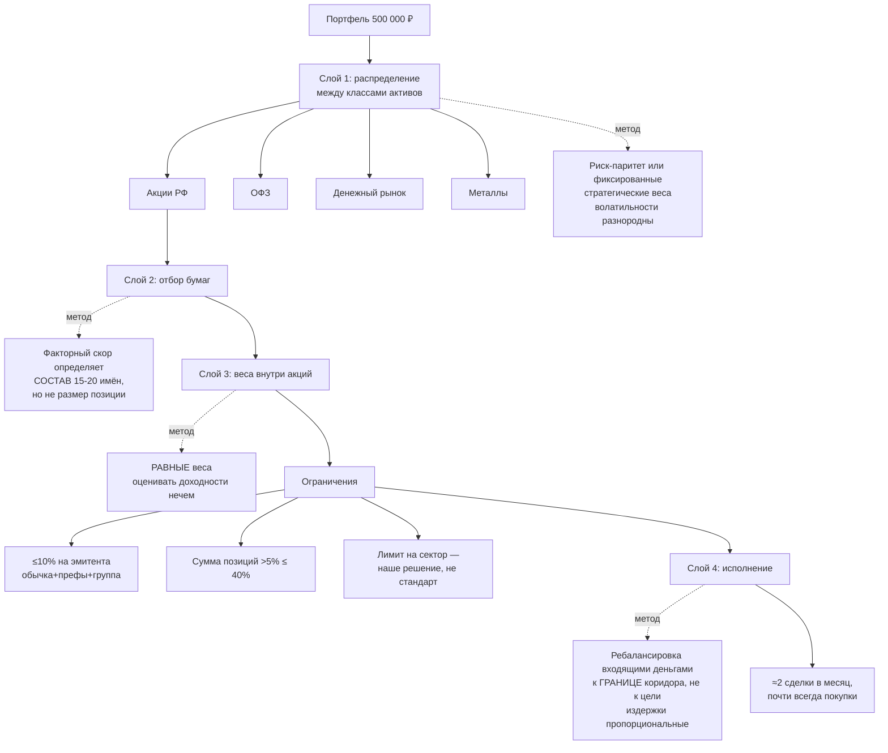

# Конструкция портфеля: что говорит литература и что из этого следует

Статус: черновик для обсуждения
Дата: 2026-08-01
Дополняет: [ключевые проектные решения](core-design-decisions.md)

Документ отвечает на вопрос «как именно составлять портфель» — сколько бумаг,
какие веса, какие лимиты. Все выводы опираются на прочитанные первоисточники;
где источник вторичный, это отмечено.

---

## 1. Не оптимизировать веса по оценённым доходностям

Главный результат в этой области — DeMiguel, Garlappi, Uppal, «Optimal Versus
Naive Diversification: How Inefficient is the 1/N Portfolio Strategy?», *Review of
Financial Studies* 22(5), 2009, с. 1915–1953. Они сравнили **14 моделей на 7
наборах данных** и обнаружили, что ни одна из них систематически не обыгрывает
наивное равное взвешивание вне выборки.

Причина — ошибка оценивания. Чтобы оптимизация по Марковицу начала выигрывать у
1/N, нужна длина окна оценивания в **3000 месяцев для портфеля из 25 активов и
более 6000 месяцев для 50 активов**. Авторы тут же замечают, что на практике эти
модели оценивают по 60 или 120 месяцам.

Их иллюстрация масштаба проблемы: два актива с истинной доходностью 8%,
волатильностью 20% и корреляцией 0.99 дают оптимальные веса 50/50. Ошибка в
оценке одной доходности на один процентный пункт (9% вместо 8%) сдвигает
рекомендацию оптимизатора к **+635% / −535%**.

Коэффициенты Шарпа вне выборки (их таблица 3, месячные):

| Набор данных | N | 1/N | Марковиц внутри выборки | Марковиц вне выборки |
|---|---|---|---|---|
| Секторы S&P | 11 | 0.1876 | 0.3848 | 0.0794 |
| Отраслевые портфели | 11 | 0.1353 | 0.2124 | 0.0679 |
| Международный | 9 | 0.1277 | 0.2090 | **−0.0332** |
| FF-1-фактор | 21 | 0.1623 | 0.5098 | 0.0128 |
| FF-4-фактора | 24 | 0.1753 | 0.5364 | 0.1841 |

Лучшая из оптимизирующих моделей — минимальная дисперсия с запретом коротких
позиций — превзошла 1/N по Шарпу значимо лишь на одном наборе из семи, по
эквиваленту определённости **ни на одном**, а по обороту проигрывала **всегда**.

Оборот и есть самое важное здесь для нашей задачи. Абсолютный месячный оборот
1/N составляет 1.6–3.1%, тогда как у неограниченных оптимизаторов относительный
оборот доходит до тысяч и десятков тысяч раз выше.

Современная репликация подтверждает вывод: Gelmini & Uberti, «The equally
weighted portfolio still remains a challenging benchmark», *International
Economics* 179, 2024. Они добавили ещё около двадцати лет данных, включая кризис
2008 года и COVID, ввели транзакционные издержки и портфель равного вклада в
риск, и заключили, что ни стабильность аллокации, ни изменение длины окна
«не достаточны, чтобы систематически обыграть наивную диверсификацию».

Честности ради, есть и оппоненты: Kritzman, Page & Turkington, «In Defense of
Optimization: The Fallacy of 1/N», *Financial Analysts Journal* 66(2), 2010. Их
аргумент — проблема не в оптимизации, а в оценивании ожидаемых доходностей по
коротким скользящим окнам; при использовании длинных окон оптимизация выигрывает.
Это, впрочем, не спор с DGU, а уточнение условия.

Сами DGU называют три условия, при которых оптимизация всё же побеждает:
**длинное окно оценивания, существенно более высокий истинный Шарп у
эффективного портфеля, и малое число активов**.

### Вывод 1

Не оценивать ожидаемые доходности и не оптимизировать по ним веса. Наш горизонт
данных на российском рынке — единицы лет с разломом 2022 года, то есть на два
порядка меньше требуемого. Веса внутри класса активов — **равные**.

---

## 2. Скор определяет состав, а не вес

Это следствие первого вывода и, пожалуй, главное архитектурное решение
документа.

Факторный скор используется, чтобы **отобрать, какие 15–20 бумаг попадут в
портфель**. Внутри отобранного множества веса равные. Скор не превращается в
величину позиции.

Почему так. Ранжирование — статистически гораздо более скромное требование, чем
оценка величины ожидаемой доходности. Чтобы сказать «эта бумага привлекательнее
той», нужен порядок, а не число. Чтобы сказать «этой нужно 7.3%, а той 4.1%»,
нужна точная оценка μ, которой у нас нет и не будет. Все выводы DGU — про вторую
задачу, а не про первую.

Побочная выгода: равные веса радикально снижают оборот. При изменении скора
бумага либо входит в портфель, либо выходит; веса остальных не пересчитываются
на доли процента, порождая мелкие дорогие сделки.

---

## 3. Сколько бумаг: концентрированному рынку нужно меньше

Классические ориентиры выведены на американском рынке. Statman, «How Many Stocks
Make a Diversified Portfolio?», *JFQA* 22(3), 1987: **не менее 30 бумаг для
заёмщика и 40 для кредитора**, что опровергало расхожее «десяти достаточно». В
2004 году он же поднял оценку до 300 бумаг с учётом издержек диверсификации.

Campbell, Lettau, Malkiel & Xu, «Have Individual Stocks Become More Volatile?»,
*Journal of Finance* 56(1), 2001, показали дрейф этой границы во времени: «в
первых двух подпериодах портфель из 20 бумаг снижал избыточное стандартное
отклонение примерно до 10%, но в подпериоде 1986–97 для того же уровня
потребовалось **50 бумаг**».

Но для нас важнее другое. Обзор 37 исследований — Zaimovic, Omanovic &
Arnaut-Berilo, «How Many Stocks Are Sufficient for Equity Portfolio
Diversification?», *JRFM* 14(11), 2021, статья 551 — фиксирует, что **на
развивающихся и концентрированных рынках требуется существенно меньше бумаг**,
чем на развитых.

Ближайший аналог российского рынка в этом обзоре — ЮАР, тоже концентрированный
рынок с доминированием добычи и финансов. Bradfield & Munro (2017): «портфели с
равными весами требуют заметно меньше бумаг для эффективного снижения риска
из-за концентрированной структуры рынка ЮАР» — **15–19 бумаг при равных весах
против 33–60 при взвешивании по капитализации**.

**Российских академических работ по минимальному числу бумаг на MOEX не
найдено.** Это честный пробел; ЮАР используется как аналог.

---

## 4. Индекс MOEX сам по себе плохо диверсифицирован

Расчёт выполнен напрямую из MOEX ISS API на дату торгов **2026-07-31** и
воспроизведён независимо дважды.

**IMOEX, 46 бумаг:**

| Метрика | Значение |
|---|---|
| Топ-5 | 49.79% |
| Топ-10 | 69.14% |
| Топ-20 | 87.56% |
| Индекс Херфиндаля | 701 |
| **Эффективное число бумаг (1/Σw²)** | **14.3** |

Крупнейшие: LKOH 16.32%, SBER 12.45%, GAZP 8.90%, YDEX 7.01%, TATN 5.11%,
T 5.06%. Отраслевая структура: нефть и газ около 42.5%, финансы около 26.2%,
три крупнейших сектора дают примерно 80% индекса.

Расширение вселенной не помогает: у индекса широкого рынка MOEXBMI из 100 бумаг
эффективное число составляет 15.4 против 14.3 у IMOEX. **Концентрация здесь
структурная, а не артефакт размера индекса.**

### Это меняет рекомендацию про «ядро в БПИФ»

В [основном документе решений](core-design-decisions.md), раздел 11.4, предложена
конструкция «ядро в БПИФ на широкий индекс плюс спутник из отдельных акций». С
учётом посчитанного выше её нужно уточнить: **БПИФ на индекс MOEX — это не
диверсифицированное ядро, а концентрированная ставка на нефтегаз с эффективным
числом бумаг около 14**.

Портфель из 20 российских акций с равными весами имеет эффективное число 20, то
есть **более диверсифицирован, чем сам индекс**. Это редкая ситуация, и она
разворачивает обычную логику «сначала индекс, потом отбор».

Практический вывод: диверсификация должна достигаться **между классами
активов** (акции, ОФЗ, денежный рынок, металлы), а внутри акций — равными
весами по 15–20 именам с ограничением на сектор. Индексный БПИФ на акции РФ
уместен как дешёвый способ получить экспозицию при малом капитале, но считать
его диверсифицированным ядром нельзя.

---

## 5. Лимиты на эмитента: взять готовый институциональный стандарт

Директива 2009/65/EC (UCITS IV), статья 52, — так называемое **правило 5/10/40**,
прочитано в оригинале:

- не более **5% активов** в бумаги одного эмитента;
- государство-член может поднять лимит до **10%**, но тогда **сумма всех позиций
  свыше 5% не должна превышать 40%** активов;
- совокупно на одного эмитента с учётом депозитов и деривативов — не более 20%;
- **компании одной группы консолидации считаются одним эмитентом**.

Применительно к IMOEX на 2026-07-31 (проверено расчётом): **LKOH 16.32% и SBER
12.45% превышают лимит в 10%**, а сумма шести позиций свыше 5% составляет
**54.85% против лимита корзины в 40%**. То есть индекс не прошёл бы
институциональный тест на диверсификацию.

Это даёт готовый, внешне санкционированный набор ограничений для оптимизатора:

| Ограничение | Значение |
|---|---|
| Максимум на эмитента | 10%, считая обыкновенные и привилегированные акции и компании одной группы как одного эмитента |
| Сумма позиций свыше 5% | не более 40% |
| Максимум на сектор | **не стандарт, а наше решение** |

Оговорка: **в UCITS нет отраслевого лимита**, правило 5/10/40 только по
эмитентам. Практикующие числа вида «не более 20–25% на сектор» не удалось
привязать ни к одному авторитетному источнику, поэтому отраслевой лимит надо
вводить как осознанное собственное решение — например, отталкиваясь от 40% как
аналогии, — и прямо называть его отклонением от структуры IMOEX с её 42.5% в
нефтегазе, а не отраслевым стандартом.

---

## 6. Риск-паритет: полезен между классами активов, бесполезен внутри акций

Maillard, Roncalli, Teïletche, «The Properties of Equally Weighted Risk
Contribution Portfolios», *Journal of Portfolio Management* 36(4), 2010,
доказывают, что волатильность портфеля равного вклада в риск лежит между
минимально-дисперсионным и равновзвешенным: σ_MV ≤ σ_ERC ≤ σ_1/N.

Но эмпирическая часть важнее теоремы:

| | Секторы акций США | Сельхозтовары | Глобальный мультиактив |
|---|---|---|---|
| Шарп 1/N | 0.62 | 0.27 | 0.27 |
| Шарп минимальной дисперсии | 0.77 | 0.74 | 0.49 |
| **Шарп ERC (риск-паритет)** | **0.65** | **0.49** | **0.67** |
| Макс. просадка 1/N против ERC | −49.0 / −47.2% | −44.1 / −36.9% | −45.3 / −22.7% |

В однородном случае — акции одного рынка — риск-паритет практически неотличим от
равных весов (Шарп 0.65 против 0.62). Их собственная формулировка: «показатели
доходности и риска портфеля ERC очень близки к аналогам для 1/N».

А вот на **мультиактивном** наборе с разнородными волатильностями риск-паритет
выигрывает решительно: Шарп 0.67 против 0.27, просадка вдвое меньше.

### Вывод 6 — прямо относится к выбранной мультиактивной вселенной

Разделение по слоям получает эмпирическое обоснование:

- **между классами активов** (акции / ОФЗ / денежный рынок / металлы) —
  риск-паритет или близкие к нему фиксированные стратегические веса. Здесь
  волатильности разнородны на порядок, и это именно тот случай, где метод
  работает;
- **внутри акций** — равные веса. Риск-паритет здесь не даст ничего, кроме
  дополнительного оборота на пересчёт весов.

---

## 7. Ковариационная матрица: сжатие снижает риск, но не улучшает Шарп

Ledoit & Wolf, «Improved estimation of the covariance matrix of stock returns
with an application to portfolio selection», *Journal of Empirical Finance* 10(5),
2003, с. 603–621. Их данные: NYSE и AMEX, 1972–1995, окно 120 месяцев,
**N от 909 до 1314**, то есть активов сильно больше наблюдений.

Годовое стандартное отклонение вне выборки для портфеля минимальной дисперсии:
сжатие к рыночной модели даёт **9.55% против 17.75% у 1/N** — снижение
волатильности на 46%; против выборочной ковариации 12.37% — на 23%. Оптимальная
интенсивность сжатия оказалась около 80% и была устойчива.

Однако для нас критична оговорка из более поздней работы — Ledoit & Wolf,
«Nonlinear Shrinkage of the Covariance Matrix for Portfolio Selection: Markowitz
Meets Goldilocks», *Review of Financial Studies* 30(12), 2017. При N = 100
портфель 1/N имеет **Шарп 0.54 против 0.44** у нелинейного сжатия, несмотря на
волатильность выше примерно на 40%.

То есть сжатие уверенно выигрывает по **риску** и не выигрывает по
**доходности на единицу риска**.

### Вывод 7

Сжатие ковариации нужно там, где целью является снижение риска: оценка
волатильности портфеля, ограничения на риск, расчёт вклада позиции в общий риск.
Оно не нужно как средство улучшить доходность. И оно вообще не применимо к нашей
задаче в исходном виде: у нас 15–20 бумаг, а не 900, то есть проблема
«N больше T» отсутствует. Для оценки риска достаточно сжатия Ledoit-Wolf к
константной корреляции на дневных данных.

---

## 8. Доля рискового портфеля: дробный критерий Келли

Thorp, «The Kelly Criterion in Blackjack, Sports Betting, and the Stock Market»,
глава 9 в *Handbook of Asset and Liability Management*, том 1, 2006, с. 385–428.

Числа для полного и половинного Келли, прочитаны дословно:

- вероятность удвоить капитал раньше, чем потерять половину: **2/3 при полном
  Келли и 8/9 при половинном**;
- темп роста половинного Келли составляет **3/4 от полного**;
- вероятность когда-либо потерять половину капитала: **1/2 при полном Келли и
  1/8 при половинном**.

Его формулировка правила: «выбор f в диапазоне **0.5·f\* ≤ f < f\*** защищает от
нулевого роста ценой снижения темпа роста не более чем на 25%». И отдельно:
«переставка наказывается гораздо строже, чем недоставка».

Особенно уместное для нас предупреждение Торпа: оценки ожидаемой избыточной
доходности «скорее завышены, чем занижены… системы, которые работали, могут
частично или полностью основываться на подгонке под данные».

Структурная связь, которая делает это не отдельной темой, а той же самой:
веса полного Келли для многих активов пропорциональны Σ⁻¹μ, то есть это в
точности касательный портфель. **Полный Келли наследует ровно ту же болезнь
ошибки оценивания, которую описывают DGU в разделе 1.** Дробный Келли, сдвигающий
портфель к деньгам, математически принадлежит тому же семейству лекарств, что
сжатие и запрет коротких позиций.

### Вывод 8

Долю рискового портфеля против денежного рынка задавать консервативно, в районе
половины от расчётной оптимальной, и никогда не превышать расчётную. При высокой
ключевой ставке денежная часть — не «простой капитала», а конкурентоспособный
актив.

---

## 9. Ребалансировка денежными потоками: подтверждено численно

Zilbering, Jaconetti, Kinniry, «Best practices for portfolio rebalancing»,
Vanguard Research, ноябрь 2015. Портфель 50% мировые акции / 50% мировые
облигации, 1926–2014:

| Стратегия | Оборот в год | Число ребалансировок | Доходность | Волатильность |
|---|---|---|---|---|
| Ежемесячно, порог 0% | 2.6% | 1068 | 8.0% | 10.1% |
| Ежеквартально, порог 5% | 1.5% | 50 | 8.3% | 10.2% |
| Ежегодно, порог 5% | 1.6% | 36 | 8.2% | 9.8% |
| **Направление дохода в недовес** | **0.0%** | **0** | **8.1%** | **9.7%** |
| Никогда | 0.0% | 0 | 8.9% | 13.2% |

Их вывод дословно: инвестор, просто перенаправлявший доход портфеля, «достиг бы
большей части выгод контроля риска, свойственных более трудозатратным и
транзакционно ёмким стратегиям, при существенно меньших издержках… различия в
риске между разными стратегиями ребалансировки были очень скромными».

Это прямое численное подтверждение вывода из раздела 11.2 основного документа
решений: **ребалансировка входящими деньгами даёт тот же контроль риска при
нулевом обороте и нулевом налоге**.

Vanguard добавляет две оговорки, обе относятся к нам. Первая: высокие дивиденды
и ставки того периода могут не повториться, поэтому надёжнее опираться на
**пополнения и выводы**, а не на доход портфеля, — что и является нашей схемой.
Вторая: концентрированный активно управляемый портфель волатильнее и «требует
более частой ребалансировки» — а российский рынок как раз концентрирован.

Полезно и их правило выбора цели ребалансировки: при преимущественно
**фиксированных** издержках оптимально возвращаться к целевой доле, при
преимущественно **пропорциональных** — к ближайшей границе допустимого коридора.
У нас издержки пропорциональные (плюс возможный минимум комиссии), поэтому
правильная цель — **граница коридора, а не точная цель**.

---

## 10. Итоговая конструкция

Всё сказанное сходится в одну схему, и приятно, что независимые линии
рассуждений дают один и тот же ответ по числу позиций: модель издержек из
основного документа даёт позицию около 25 000 ₽ на портфеле 500 000 ₽, то есть
около 20 позиций, а литература по диверсификации на концентрированных рынках
даёт 15–19 имён при равных весах.

| Слой | Решение | На чём основано |
|---|---|---|
| Между классами активов | риск-паритет либо фиксированные веса | Maillard и др. 2010: работает при разнородных волатильностях |
| Доля риска против денег | дробный Келли, около половины расчётного | Торп 2006: 3/4 роста при 1/8 риска разорения |
| Отбор акций | факторный скор задаёт состав 15–20 имён | DGU 2009: ранжировать можно, оценивать μ нельзя |
| Веса внутри акций | равные | DGU 2009, Gelmini & Uberti 2024 |
| Лимиты | 10% на эмитента, сумма позиций свыше 5% до 40% | UCITS IV, статья 52 |
| Оценка риска | сжатие Ledoit-Wolf к константной корреляции | Ledoit & Wolf 2003, только для риска |
| Ребалансировка | входящими деньгами, к границе коридора | Vanguard 2015 |

Отдельно стоит отметить, что эта конструкция **не содержит ни одного места, где
оценивается ожидаемая доходность в абсолютных величинах**. Это осознанно: именно
такая оценка является источником катастрофической ошибки во всех прочитанных
работах.

---

## 11. Чего не удалось найти

Честный список пробелов, чтобы они не выглядели как решённые вопросы:

- **российских рецензируемых работ по минимальному числу бумаг на MOEX нет.**
  Единственная найденная эмпирическая работа по сравнению методов на MOEX —
  Зорин, «Бритва Оккама как критерий сравнения методов портфельной оптимизации:
  случай российского рынка», *Дневник науки* №2, 2026 — магистерского уровня в
  небольшом журнале, на 244 бумагах MOEX за 2024–2026 с недельной
  ребалансировкой. Её результат согласуется с общим выводом (равные веса лучшие
  или близки к лучшим по Шарпу и радикально лучшие по обороту), но двухлетняя
  выборка в одном режиме рынка не может быть несущим свидетельством;
- **отраслевой лимит концентрации не имеет авторитетного источника** — только
  эмитентский, из UCITS;
- работы по факторным премиям на российском рынке после 2022 года в этот заход
  не искались; это остаётся главным открытым вопросом, поскольку от него зависит,
  нужен ли слой 2 вообще;
- часто цитируемая цифра «82% из 50 000 оптимизаций» из работы Kritzman и др.
  проверку не прошла, источник закрыт — **в отчётах не использовать**.

Если факторные премии на MOEX после 2022 года не воспроизводятся, слой отбора
бумаг отпадает, и остаётся распределение между классами активов с равными весами
внутри акций. Это был бы вполне достойный результат, а не провал: такая система
проще, дешевле в эксплуатации и опирается на самые надёжные из прочитанных
свидетельств.
