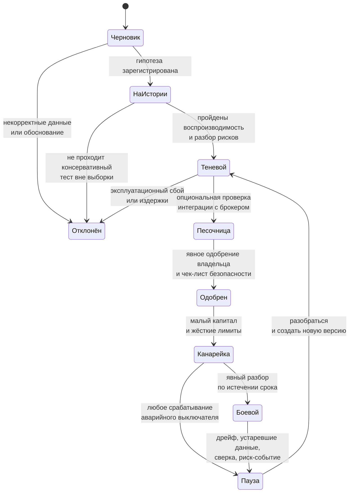

# Протокол экспериментов Nagi

Статус: предложение
Назначение: сделать сравнение стратегий опровержимым, воспроизводимым и
устойчивым к переобучению на исторических данных

## 1. Контракт эксперимента

Каждый эксперимент после активации неизменяем и фиксирует:

- исследовательский вопрос и экономическое обоснование;
- нулевую и альтернативную гипотезы;
- вселенную инструментов и правило допуска;
- точные определения признаков и задержки доступности данных;
- хеши кода стратегии и конфигурации, идентификатор снимка данных;
- бенчмарк, график денежных потоков, метки времени решения и исполнения;
- версии моделей издержек, исполнения, налогов и корпоративных действий;
- первичную метрику, вторичные метрики, горизонт и правило остановки;
- пространство перебора параметров и полное семейство связанных тестов;
- автора, время создания, статус и родительский эксперимент.

Изменение веса создаёт дочерний эксперимент и никогда не перезаписывает историю.
Провалившиеся и заброшенные прогоны остаются видимыми.

## 2. Начальные гипотезы

| ID | Альтернативная гипотеза | Нулевая | Первичная конечная точка |
|---|---|---|---|
| H0 | Пассивное регулярное инвестирование — работоспособная эксплуатационная базовая линия. | Система не может воспроизвести бенчмарк и денежные потоки после издержек. | ошибка слежения и ошибка сверки |
| H1 | Распределение между классами активов улучшает результат против портфеля из одних акций. | прирост чистой полезности ≤ 0 | парная разница полезности вне выборки |
| H2 | Моментум 12−1 улучшает чистый результат против H0. | чистая альфа ≤ 0 | парная чистая альфа вне выборки с HAC-интервалом |
| H3 | Value вместе с quality лучше, чем value отдельно. | прирост чистой полезности ≤ 0 | парная разница полезности вне выборки |
| H4 | Низкая волатильность снижает риск падения без неприемлемой потери доходности. | MAR и ожидаемые потери в хвосте не улучшаются | MAR плюс ожидаемые потери на уровне 95% |
| H5 | Дивидендное качество лучше наивной высокой дивидендной доходности. | альфа полной доходности ≤ 0 | чистая альфа полной доходности |
| H6 | Полосы бездействия с учётом издержек лучше полной ежемесячной ребалансировки. | чистая полезность не улучшается | доходность минус штрафы за риск и издержки |
| H7 | Заранее объявленный макро-оверлей снижает риск левого хвоста. | ожидаемые потери в хвосте не улучшаются | ожидаемые потери на уровне 95% |
| H8 | Признаки событий из первичных источников добавляют ценность после контроля на H1–H6. | прирост чистой альфы ≤ 0 | парный прирост чистой альфы |

В первый исследовательский цикл входят только H0 и H1. Учитывая выбранную
мультиактивную вселенную и размер портфеля, распределение между классами активов
важнее отбора отдельных бумаг, и проверять его надо первым. H8 запускается только
после того, как конвейер point-in-time данных по рынку и фундаменталу станет
достоверным.

## 3. Группы сравнения

Каждый прогон получает идентичные датированные денежные потоки и
детерминированную ценовую политику:

- `B0_cash`: рубли или явно выбранный аналог денежного рынка;
- `B1_passive`: инвестируемый аналог пассивной полной доходности;
- `B2_policy`: пассивное распределение плюс та же политика пополнений и выводов;
- `E_*`: ровно одно изменение относительно родителя;
- `production_candidate`: замороженная стратегия в теневом режиме;
- `actual`: реальный счёт, исключённый из отбора до продвижения.

Индекс MOEX `MCFTRR` полезен как отчётный ориентир, но сам по себе не обязательно
является инвестируемым продуктом. Выбор бенчмарка обязан включать реально
доступный инструмент слежения, его издержки, доступность неквалу и фактический
порядок работы с деньгами.

## 4. Правила point-in-time данных

Ни одна строка не может влиять на решение раньше момента
`available_to_strategy_at`.

Обязательные временные поля:

- `event_at` — когда произошло экономическое событие;
- `published_at` — заявленное источником время публикации с часовым поясом;
- `first_seen_at` — когда Nagi впервые это увидел;
- `available_to_strategy_at` — публикация или наблюдение плюс объявленная
  задержка обработки;
- `ingested_at` — время записи в хранилище;
- `valid_from`, `valid_to` — интервал действительности в реальном мире;
- `recorded_at` и при необходимости `superseded_at` — интервал системного времени.

Для фундаментальных показателей обязательны период отчёта, время публикации,
номер ревизии и источник. Состав вселенной восстанавливается на каждую дату,
включая делистингованные и переименованные бумаги. Корректировки на корпоративные
действия сохраняют исходные значения и провенанс корректировки. Текущий состав
индексов, текущие флаги доступности и сегодняшние исправленные фундаментальные
данные запрещены в исторических решениях.

## 5. Протокол walk-forward

Для низкооборотной стратегии на дневных и месячных данных используются
расширяющиеся или скользящие окна:

1. начальное обучение — 5–8 лет, если они действительно есть;
2. валидация — 1–2 года для небольшого заранее объявленного набора параметров;
3. тест — 6–12 месяцев, не затронутые отбором;
4. сдвинуть окно и повторить;
5. сохранить финальный незатронутый отложенный период либо фазу теневого прогона.

Результаты до 2022 года, в переходный период и после 2022 года публикуются
раздельно. Усреднять структурный разлом нельзя. Если глубины истории не хватает
на протокол, упрощается гипотеза, а не защитные меры.

Пересекающиеся метки требуют очищенных разбиений и эмбарго. Доверительные
интервалы бутстрапом строятся по блокам времени, а не независимой перевыборкой
дней.

## 6. Издержки и исполнение

В момент решения оценивается

```
Издержки = Σ |Δq_i| × P_i × (комиссия_i + полспреда_i + проскальзывание_i
                             + влияние_на_рынок_i)
         + фиксированные_сборы + налоговый_эффект
```

Отдельно учитывается **минимальная комиссия за сделку**, если брокер её берёт:
при малом размере портфеля она превращается в жёсткий пол на размер заявки и
может делать дробление покупки между несколькими бумагами убыточным.

Пока модель не откалибрована по реальным исполнениям, публикуются три сценария:
оптимистичный, базовый и стрессовый. Консервативная первая модель исполнения
использует следующий торгуемый бар, округление по шагу цены и лоту, статус
торговой сессии, частичные и отклонённые исполнения, максимальную долю от
среднего объёма и границу неблагоприятной цены. Исполнение по той же цене
закрытия, которая породила сигнал, запрещено.

Фиксируются: время появления намерения, время отправки, подтверждение брокера,
каждое исполнение, каждая комиссия и результат сверки. Результаты песочницы
являются эксплуатационным свидетельством и ничем более.

### Хранение формулы и весов

У инструмента никогда нет изменяемой колонки `score`. Неизменяемая запись
`strategy_version` ссылается на:

- определения признаков и точные лаги доступности;
- преобразования, кросс-секционную вселенную, обрезку выбросов и политику
  пропущенных значений;
- веса факторов и при необходимости параметры режимов;
- целевую функцию оптимизатора, ограничения и политику ребалансировки;
- версии моделей издержек, исполнения и налогов;
- коммит исходного кода и хеш конфигурации.

Для прозрачной взвешенной модели каждый признак приводится к сопоставимой шкале,
например робастным секторно-относительным кросс-секционным скором:

```
z(i,k,t) = clip( (x(i,k,t) − median_сектор(k,t)) / (1.4826 × MAD_сектор(k,t)),
                 −3, +3 )
s(i,t)   = Σ_k w_k × z(i,k,t)
```

Медиана и MAD вместо среднего и стандартного отклонения выбраны потому, что на
рынке из нескольких десятков ликвидных имён один выброс ломает нормировку.
Конкретная группировка по секторам и правило для малых секторов — параметры
эксперимента, а не универсальная истина.

Каждый плановый пересчёт создаёт `evaluation_run` и неизменяемые строки
`signal_observation(strategy_version, instrument, as_of, available_at, value,
data_snapshot)`. Он может обновить одноразовый кеш для дашборда, но никогда не
перезаписывает историю. Изменение даже одного веса или лага создаёт дочернюю
версию стратегии и эксперимента.

Скор ранжирует ожидаемую привлекательность и не является заявкой. Текущие
позиции, ковариация рисков, денежные потоки, лоты, доступность, ликвидность,
издержки и ограничения применяются после него портфельным оптимизатором.

## 7. Правило принятия портфельного решения

Сначала формируется цель, затем из неё выводятся сделки. Сортировать скалярный
скор и слепо продавать худшее имя запрещено.

Входы оптимизатора: ранги ожидаемой доходности, оценки риска и ковариации,
текущие налоговые лоты со сроками владения, потребность в деньгах, доступность,
ликвидность, издержки и ограничения. Продажа обосновывается наилучшим переходом
портфеля в целом, а не низким текущим скором позиции. Допустимые причины:
финансирование вывода, потеря доступности инструмента, нарушение ограничения,
изменившийся сигнал, снижение риска или явно превосходящая замена с учётом
издержек.

Приоритет сделки равен отношению прироста ожидаемой полезности к консервативной
оценке издержек. Пополнения в первую очередь направляются в недовешенные активы.
Для вывода средств решается задача поиска наименее разрушительного допустимого
набора продаж, и владельцу показываются ожидаемые издержки и отклонение от цели
до того, как заявка сможет возникнуть.

Жёсткие предохранители отделены от экономической политики:

- максимальный оборот в деньгах за день, неделю и месяц;
- максимальный размер заявки и позиции;
- максимальная экспозиция на эмитента, сектор и класс активов;
- минимальный резерв денег и минимальная ликвидность;
- никакого плеча, шортов, производных и рыночных заявок на начальном этапе;
- блокировки по устаревшим данным, спреду, волатильности и статусу сессии;
- аварийные выключатели по серии убытков, отказов или ошибок сверки.

## 8. Метрики

Первичная результативность считается после модельных или фактических издержек.

- доходность, взвешенная по времени, — для оценки качества стратегии;
- денежно-взвешенная XIRR — для оценки опыта владельца с учётом его пополнений;
- CAGR, волатильность, Шарп и Сортино;
- максимальная просадка, Калмар и MAR;
- VaR и ожидаемые потери в хвосте на уровне 95%;
- полный и односторонний оборот, атрибуция комиссий, спреда и проскальзывания;
- альфа, бета, ошибка слежения и активная доля против бенчмарка;
- экспозиция на эмитента, сектор и факторы, число дней на ликвидацию;
- намеренные веса против фактических и ошибки сверки с брокером.

Для парных стратегий публикуется ряд разницы доходностей с интервалами
Ньюи–Уэста. Экономическая величина эффекта и его устойчивость по разбиениям и
режимам важнее порогового p-значения.

## 9. Множественная проверка гипотез и продвижение

- одна первичная конечная точка на гипотезу;
- поправка Холма для небольшого подтверждающего семейства либо процедура
  Бенджамини–Хохберга для объявленного исследовательского семейства;
- дефлированный коэффициент Шарпа после отбора среди конфигураций;
- проверка реальности Уайта или SPA Хансена при выборе лучшей из многих
  стратегий;
- фиксировать число опробованных конфигураций и отброшенных экспериментов;
- заморозить победителя до начала теневой оценки вперёд.

Гейты продвижения:



Ни один автоматический переход не ведёт в состояния «Одобрен», «Канарейка» и
«Боевой».

## 10. Длительность и интерпретация

Большее число сделок не даёт большего числа независимых наблюдений. Для месячных
доходностей стандартная ошибка убывает лишь примерно как корень из числа
периодов, а автокорреляция и смена режимов ухудшают и это.

Численно (вывод в разделе 3 документа с проектными решениями): чтобы отличить
стратегию с коэффициентом Шарпа 0.5 от нуля на уровне значимости 95%, требуется
около **16 лет** наблюдений; при пороге t = 3, уместном при переборе вариантов, —
около 36 лет. Парное сравнение на общих ценах и общих денежных потоках сокращает
срок в разы, но не до месяцев.

Отсюда прямое следствие: от шести до двенадцати месяцев теневой эксплуатации
способны выявить дефекты данных, планировщика, исполнения и издержек, но
практически никогда не доказывают наличие небольшой альфы. Даже пять–десять лет
могут оставить широкий доверительный интервал.

Поэтому система обязана предпочитать сильные экономические априори, простые
модели, консервативные издержки и устойчивые эффекты — а не визуально
впечатляющую таблицу лидеров за два месяца.
